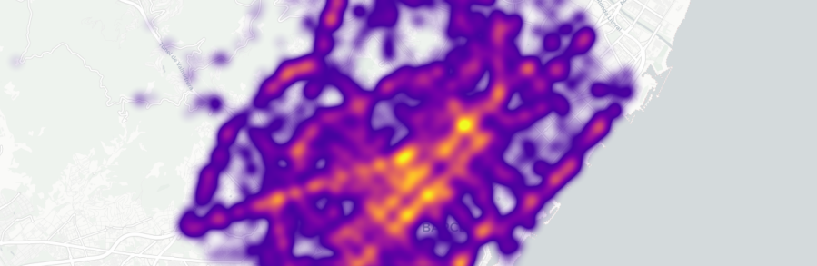

# Accidents de tràfic a Barcelona, anàlisi de les dades

Aquest projecte ofereix una analisi exhaustiva de les dades recollides per la Guardia Urbana de Barcelona relatives a accidents de tràfic durant l'any 2023, i publicades a [Open Data BCN](https://opendata-ajuntament.barcelona.cat/en).

El projecte està realitzat en un jupyter notebook i s'estructura en diferents seccions, cadascuna relativa als següents aspectes:

-   Distribució dels accidents de tràfic a la ciutat
    -   Accidents per districte
    -   Accidents per barri
    -   Geoposició dels accidents
    -   Mapa de calor dels punts més conflictius
    -   Carrers amb més accidents
    -   Xamfrans amb més accidents
-   Vehicles implicats en accidents
    -   Tipus de vehicles implicats
    -   Nombre de vehicles implicats
-   Distribució en el temps dels accidents
    -   Dies de la setmana amb un major nombre d'accidents
    -   Mesos de l'any amb un major nombre d'accidents
    -   Hores del dia amb un major nombre d'accidents
-   Victimes
-   Causes dels accidents
-   Tipologia dels accidents
-   Tipus de carnet i antiguitat en relació als accidents
-   Persones implicades, conductor, passatger, vianant
-   Atropellaments

## Objectius

Realitzar una anàlisi de les dades per extreure coneixement que ens permeti:

-   Identificar patrons recurrents
-   Identificar posibles patrons temporals, moments del dia o del any amb un risc elevat d'accidents
-   Identificar arees amb un alt risc d'accidents a la ciutat
-   Analitzar les causes dels accidents
-   Analitzar la severitat dels accidents, nombre de víctimes i tipus

## Descripció del conjunt de dades

Analitzem 6 conjunts de dades:

1. **Accidents gestionats per la Guàrdia Urbana a la ciutat de Barcelona**. Llistat dels accidents gestionats per la Guàrdia Urbana a la ciutat de Barcelona. Incorpora el número de lesionats segons gravetat, el número de vehicles implicats i el punt d'impacte.
2. **Vehicles implicats en accidents gestionats per la Guàrdia Urbana a la ciutat de Barcelona**
    - Llistat dels vehicles implicats en accidents gestionats per la Guàrdia Urbana a la ciutat de Barcelona. Un accident pot tenir associat més d’un vehicle. Inclou si la causa és del vianant, el tipus de vehicle, model, marca, color i tipus carnet i antiguitat de la persona que ho conduïa.
3. **Persones involucrades en accidents gestionats per la Guàrdia Urbana a la ciutat de Barcelona**
    - Llistat de les persones que han estat involucrades en un accident gestionats per la Guàrdia Urbana a la ciutat de Barcelona i que han sofert algun tipus de lesió ( ferit lleu, ferit greu o mort). Inclou descripció de la persona (conductor, passatger o vianant), sexe, edat, vehicle associat a la persona i si la causa ha sigut del vianant.
4. **Accidents segons tipologia gestionats per la Guàrdia Urbana a la ciutat de Barcelona**
    - Relació d'accidents segons tipologia gestionats per la Guàrdia Urbana a la ciutat de Barcelona. Un accident pot estar tipificat amb vàries tipologies ( Ex: xoc contra element estàtic i col·lisió front-lateral)
5. **Accidents segons causa mediata gestionats per la Guàrdia Urbana a la ciutat de Barcelona**
    - Relació dels accidents segons causa mediata gestionats per la Guàrdia Urbana a la ciutat de Barcelona. Un accident pot tenir una o més causes mediates les quals fan referència a factors externs del resultat en temps, lloc o grau (Ex: Alcoholèmia i Excés de velocitat o velocitat inadequada)
6. **Accidents segons causa conductor gestionats per la Guàrdia Urbana a la ciutat de Barcelona**
    - Accidents segons causa conductor gestionats per la Guàrdia Urbana a la ciutat de Barcelona.
